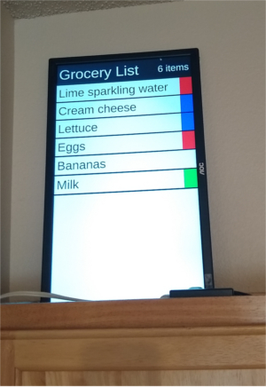
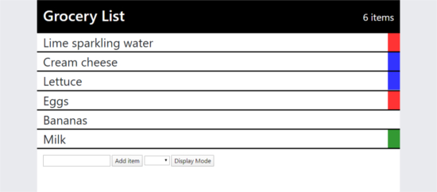
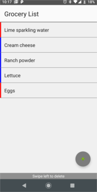

# kitchen-display-app

An app for displaying and editing my personal grocery list.

Kitchen view:

I originally only wanted to display my grocery list in my kitchen as a gimmick but I decided to make it a little more functional but it's still a gimmick. I made a web front-end and an Android front-end that talk to my Node server. The Node server simply serves the grocery list items from a SQLite database. The web version is designed for phones, computers, and to display in my kitchen and built using Vue. I had very little experience building Android apps and I had never used Kotlin but I learned them to make a decent looking and working Android app. The web and Android version both use WebSockets to display an always up to date list. In my kitchen I have the web version pulled up on a Raspberry Pi connected to a monitor to always see my current grocery list from my kitchen.
 

Website for any device and for the display in my kitchen:

https://palu3492.github.io/kitchen-display-app/

Android:

[APK here](android/app/build/outputs/apk/debug/app-debug.apk)

